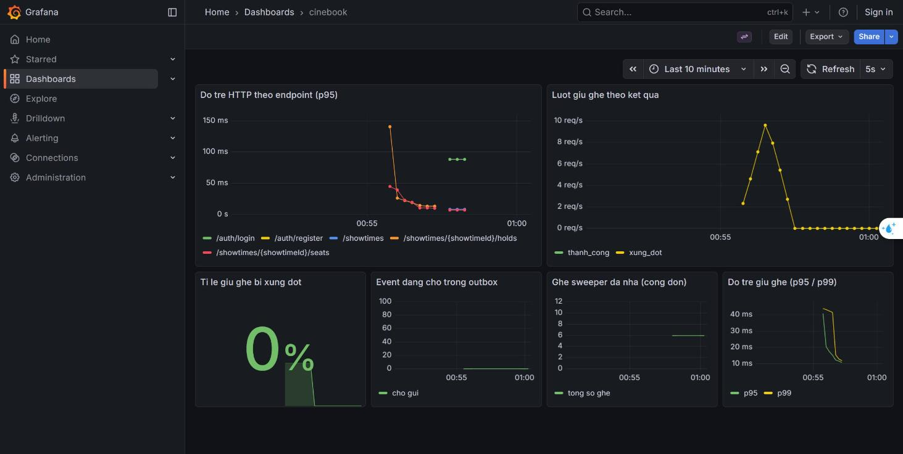

# Kết quả đo tải

## Điều kiện đo

Một con số không có điều kiện đo là một con số vô nghĩa. Mọi số liệu dưới đây đo trong đúng bối cảnh này:

| Hạng mục | Giá trị |
|---|---|
| Máy | Windows 11, 24 CPU logic. **Mọi thứ chạy trên cùng một máy**: Postgres, Redis, Kafka, Prometheus, Grafana trong Docker; `cinebook-api` và `cinebook-worker` chạy bằng `java -jar` trên host |
| Sinh tải | k6 1.5.0 trong container, gọi qua `host.docker.internal:8080` |
| Thời lượng | 60 giây, 50 VU (40 người xem, 8 người giành ghế, 2 người mua) |
| Dữ liệu | Profile `demo`: 10 phim, 3 rạp, 9 phòng, 96 ghế mỗi phòng, ~200 suất chiếu trong tương lai |
| Vùng tranh chấp | Hai hàng D và E của **một** suất chiếu — 24 ghế cho 10 VU giành nhau |
| Kết nối DB | HikariCP mặc định, tối đa 10 |

Con số tuyệt đối phụ thuộc máy. Thứ đáng đọc là **tỉ lệ trước/sau trên cùng một máy**, không phải giá trị tuyệt đối.

## Baseline — trước khi tối ưu

Lần chạy ngày 2026-08-20, commit trước khi có tối ưu nào.

### Phía client (k6 đo, tức thứ người dùng thật cảm nhận)

| Đường | avg | p90 | p95 | max |
|---|---|---|---|---|
| `GET /showtimes/{id}/seats` | 250 ms | 494 ms | **1,05 s** ✗ | 1,17 s |
| `POST /showtimes/{id}/holds` | 74 ms | 93 ms | **111 ms** ✓ | 283 ms |

| Chỉ số | Giá trị |
|---|---|
| Tổng request | 1 689 (26,3 req/s) |
| Tỉ lệ lỗi | **0,00 %** |
| Giữ ghế thành công | 22 |
| Giữ ghế xung đột (409) | 518 |
| Tỉ lệ xung đột | **95,9 %** |

Ngưỡng `p95 < 300 ms` cho seat map **không đạt**. Ngưỡng của đường giữ ghế đạt thoải mái.

### Phía server (Micrometer đo)

| Đường | p95 | p99 |
|---|---|---|
| `/showtimes/{showtimeId}/seats` | 971 ms | 1 055 ms |
| `/showtimes/{showtimeId}/holds` | 108 ms | — |

Server-side p95 (971 ms) gần như trùng client-side p95 (1,05 s). **Độ trễ nằm trong ứng dụng**, không phải ở mạng hay ở k6.

### Tài nguyên

| Chỉ số | Giá trị |
|---|---|
| `hikaricp_connections_active` | **10 / 10** — pool cạn |
| `hikaricp_connections_pending` (đỉnh) | 3, có lần chạy lên tới **30** |
| CPU tiến trình api | 12 % |
| CPU toàn máy | 41 % |

## Điểm nghẽn: không phải SQL, mà là số lượt đi lấy kết nối

`EXPLAIN (ANALYZE, BUFFERS)` trên chính hai truy vấn của seat map, với dữ liệu thật:

```
Index Scan using idx_seat_hold_showtime on seat_hold   Execution Time: 0.026 ms
Sort + Bitmap Heap Scan on seats (96 dòng)             Execution Time: 0.33 ms
```

Hai truy vấn cộng lại chưa tới **0,4 ms**, trong khi endpoint mất **971 ms** ở p95. Vậy thời gian không nằm ở database.

Đọc `SeatMapQueryJdbc` cùng `ShowtimeQueryJdbc.findDetail`, thoạt nhìn một lượt gọi seat map thực hiện **ba lượt truy vấn tách rời**: header của suất chiếu, 96 ghế của phòng, và các hold đang hiệu lực. Ba lượt đó **không nằm trong một transaction**, nên mỗi lượt mượn và trả một connection riêng.

Nhưng đọc kỹ hơn thì con số không phải ba (xem phần tiếp theo). Điều chắc chắn ngay ở bước này: với 40 người xem đồng thời, pool 10 connection trở thành hàng đợi — `active = 10/10`, `pending` có lúc lên 30 — trong khi CPU chỉ 12 %.

**Kết luận: hệ thống không thiếu CPU và không chậm ở SQL. Nó xếp hàng chờ kết nối.**

## Tối ưu: đọc bảng giá một lần thay vì 96 lần

Đọc kỹ `ShowtimeQueryJdbc.findDetail` cùng `PriceQueryJpa.priceFor` cho thấy con số thật:

```java
for (Map<String, Object> row : jdbc.queryForList(SQL_SEATS, ...)) {   // 96 ghế
    seats.add(new SeatView(..., priceQuery.priceFor(basePrice, seatType)));
}                                    // ↑ mỗi lần gọi lại findAll() bảng price_rules
```

Một lượt xem sơ đồ ghế không phải 3 lượt truy vấn mà là **99**: 1 header + 1 seats + **96 lượt đọc bảng giá** + 1 lượt đọc hold. Mỗi lượt mượn và trả một connection từ pool 10.

Điều đáng nói: chính lớp `PriceQueryJpa` đã ghi chú từ Milestone 3 rằng nó cố ý đọc lại mỗi lần, kèm câu *"tối ưu khi đã đo, không tối ưu vì linh cảm"*. Đây là lúc đã đo.

**Cách sửa: `PriceQuery.bangGia()` trả một bản chụp, đọc một lần rồi dùng cho cả 96 ghế.** Bản chụp chỉ sống trong phạm vi một lần gọi — **không phải cache**, nên không có chuyện trả giá cũ. Không thêm Redis, không thêm TTL, không thêm gì phải vô hiệu hoá.

Một thay đổi duy nhất, rồi đo lại.

## Sau khi tối ưu

Cùng máy, cùng 50 VU, cùng 60 giây, cùng dữ liệu, cùng kịch bản.

| Đường | | Trước | Sau | Nhanh hơn |
|---|---|---|---|---|
| seat map | avg | 250 ms | **12,5 ms** | 20× |
| seat map | p90 | 494 ms | 22,2 ms | 22× |
| seat map | **p95** | **1,05 s** ✗ | **34,4 ms** ✓ | **30×** |
| seat map | max | 1,17 s | 72,2 ms | 16× |
| giữ ghế | avg | 74 ms | **16,6 ms** | 4,5× |
| giữ ghế | p95 | 111 ms | **24,3 ms** | 4,6× |
| toàn hệ | throughput | 26,3 req/s | **29,0 req/s** | +10 % |
| toàn hệ | tỉ lệ lỗi | 0,00 % | 0,00 % | — |

Cả hai ngưỡng đều đạt. Phía server (Micrometer đo): seat map p95 **971 ms → 17,6 ms**.

### Vì sao nhanh hơn — cơ chế, không phải phép màu

| Chỉ số | Trước | Sau |
|---|---|---|
| `hikaricp_connections_active` (đỉnh) | **10 / 10** (cạn) | **0** |
| `hikaricp_connections_pending` (đỉnh) | 3, có lần 30 | **0** |
| CPU tiến trình api | 12 % | 3,5 % |

Bỏ 96 lượt truy vấn mỗi request khiến connection không còn là hàng đợi. Pool 10 vốn không thiếu — nó bị **một vòng lặp** làm cạn.

**Đường giữ ghế cũng nhanh lên 4,6 lần dù không sửa một dòng nào của nó.** Đó là bằng chứng rõ nhất rằng nút thắt là tài nguyên dùng chung: khi seat map thôi giữ hết connection, mọi đường khác thở được.

### Những gì KHÔNG cải thiện

- **Tỉ lệ xung đột vẫn ~96 %** (560 xung đột / 20 thành công). Đúng như mong đợi: đó là do kịch bản dựng 10 VU giành 24 ghế, không liên quan gì tới tốc độ.
- **Throughput chỉ tăng 10 %** dù độ trễ giảm 30 lần. Cũng đúng: k6 chạy `constant-vus` với `sleep` cố định giữa các vòng, nên số request bị nhịp ngủ khống chế chứ không bị độ trễ khống chế. Muốn đo throughput tối đa thì phải đổi sang executor `constant-arrival-rate` — một bài đo khác.
- **Cache Redis cho seat map: không làm.** Giả thuyết đứng đầu ở mục 2.3 của spec hoá ra không cần thiết: sau khi bỏ vòng lặp 96 lượt, p95 còn 34 ms, cách ngưỡng 300 ms rất xa. Thêm một lớp cache lúc này là thêm một thứ có thể trả dữ liệu cũ để đổi lấy một khoản lợi mà số liệu không đòi.

## Những gì cần nhớ khi đọc lại

- **Tỉ lệ xung đột 95,9 % là do kịch bản cố ý dựng**: 10 VU giành 24 ghế. Nó không nói lên rằng hệ thống thật sẽ có 96 % người dùng thất bại — nó nói rằng đường tranh chấp vẫn giữ đúng bất biến dưới áp lực cực đại, và không có lỗi 5xx nào.
- **409 không được tính là lỗi.** Lần chạy đầu tiên tôi đặt `responseCallback` sai chỗ và k6 báo `http_req_failed = 26,97 %` — đúng bằng số lượt 409. Con số đó vô nghĩa. Cách đúng là `http.setResponseCallback()` ở init context.
- **Độ trễ seat map dao động đáng kể giữa các lần chạy** (p95 594 ms → 908 ms → 1,05 s trên cùng cấu hình). Máy này chạy cả hạ tầng lẫn ứng dụng lẫn bộ sinh tải, nên nhiễu là điều phải chấp nhận. Vì vậy phần "sau khi tối ưu" phải đo lại **cùng máy, cùng lúc, cùng kịch bản**, và nên chạy vài lần rồi lấy khoảng.


## Trace phân tán

Sau khi bật OpenTelemetry, Jaeger nhận trace từ cả hai deployable (`cinebook-api`, `cinebook-worker`), và mọi dòng log mang `traceId`/`spanId` — dán id từ log vào Jaeger là thấy đường đi.

**Nối được:** `outboxRelayJob.relay` → `booking.events send` → `booking.events process` nằm trong **cùng một trace**:

```
task outboxRelayJob.relay   150,87 ms
  booking.events send        77,40 ms   (producer)
  booking.events process     34,67 ms   (consumer)
```

Chỉ có được sau khi bật `spring.kafka.template.observation-enabled` và `spring.kafka.listener.observation-enabled`. Không bật thì producer và consumer là hai trace rời rạc.

**KHÔNG nối được — và đây là hệ quả trực tiếp của thiết kế outbox:** request HTTP ban đầu (`POST /demo/payments/{id}/succeed`) không nối với trace của relay. Lý do: outbox **cố ý cắt** chuỗi đồng bộ — api chỉ ghi một dòng vào bảng và commit; một tiến trình khác đọc dòng đó vài trăm mili giây sau, trong một trace của riêng nó. Bảng `outbox_events` không mang trace context.

Muốn nối thì phải thêm cột `trace_context` vào `outbox_events`, ghi `traceparent` lúc `OutboxWriter.write(...)`, rồi khôi phục context ở relay trước khi publish. Chưa làm — nhưng ghi ra đây để người đọc biết đó là lựa chọn chứ không phải thiếu sót bị bỏ quên.

**Không có span cho từng truy vấn DB.** Micrometer không tự đo `JdbcTemplate`; muốn có thì phải thêm `datasource-micrometer-spring-boot`. Với dự án này thì `EXPLAIN ANALYZE` và metric HikariCP đã đủ để tìm ra điểm nghẽn, nên chưa thêm.

## Một cái bẫy của build, phát hiện khi làm milestone này

Fat jar của `cinebook-worker` **gói `cinebook-api` lấy từ `~/.m2`**, không phải từ thư mục `target/` vừa build. Quan sát được: sau `mvn -DskipTests package` toàn reactor, jar worker vẫn chứa `cinebook-api-0.1.0-SNAPSHOT.jar` cũ hai ngày (thiếu hẳn `SweepExpiredHoldsUseCase`), và worker chết lúc khởi động với `FileNotFoundException: class path resource [...SweepExpiredHoldsUseCase.class] cannot be opened`.

`mvn clean install` (sau khi **dừng mọi tiến trình đang chạy** — Windows khoá file jar và `clean` sẽ thất bại) cho ra jar đúng.

Đây là loại lỗi nguy hiểm vì im lặng: worker có thể chạy code api cũ mà không báo gì, chỉ lệch hành vi. Lệnh build trước khi chạy worker phải là `clean install`, không phải `package`.


## Metric nghiệp vụ trong lúc k6 chạy

Đo qua **chính datasource của Grafana** (không phải hỏi thẳng Prometheus), tức đúng đường mà panel dùng:

| Truy vấn của panel | Giá trị lúc đang chạy tải |
|---|---|
| `sum by (ket_qua) (rate(cinebook_seat_hold_seconds_count[1m]))` | ~9,8 lượt/giây, toàn bộ mang nhãn `xung_dot` |
| `histogram_quantile(0.95, ... cinebook_seat_hold_seconds_bucket ...)` | 17 ms |
| `cinebook_outbox_pending` | **0** — relay theo kịp, không có event nào đọng |
| `histogram_quantile(0.95, ... http_server_requests_seconds_bucket{uri=~".*seats.*"} ...)` | 22,3 ms |
| `cinebook_sweeper_released_total` | chưa có số trong 5 phút — đúng, vì kịch bản tự huỷ booking chứ không để hold hết hạn |

### Dashboard trong lúc chạy tải



Sáu panel, đọc từ trái sang:

| Panel | Đọc được gì |
|---|---|
| Độ trễ HTTP theo endpoint (p95) | Đường `/showtimes/{id}/seats` nằm dưới 50 ms trong suốt đợt tải — sau tối ưu |
| Lượt giữ ghế theo kết quả | Đỉnh ~9,5 lượt/giây, tách riêng `thanh_cong` và `xung_dot` |
| Tỉ lệ giữ ghế bị xung đột | Tụt về 0 % khi hết đợt tranh chấp |
| Event đang chờ trong outbox | Phẳng ở 0 — relay theo kịp, không có event nào đọng |
| Ghế sweeper đã nhả (cộng dồn) | 6 ghế, đúng bằng dòng log `Sweeper nha 6 ghe het han` của worker |
| Độ trễ giữ ghế (p95/p99) | 10–40 ms |

**Ảnh này lúc đầu không chụp được**: phiên trình duyệt tự động render ra khung trống dù dashboard nạp đúng và truy vấn có số liệu. Nguyên nhân là extension **Dark Reader** — đúng thứ đã làm sai lệch việc kiểm tra giao diện ở Milestone 7. Tắt nó đi là panel hiện bình thường. Ai chụp lại để đưa vào tài liệu thì nhớ tắt trước.

**Một panel phải sửa vì nó vô dụng trong demo**: "Ghế sweeper nhả" ban đầu dùng `increase(cinebook_sweeper_released_total[5m])`, và counter vừa xuất hiện thì `increase` không vẽ gì — panel nằm `No data` suốt dù worker vừa nhả 6 ghế. Đổi sang `sum(cinebook_sweeper_released_total)` (cộng dồn) thì thấy ngay.